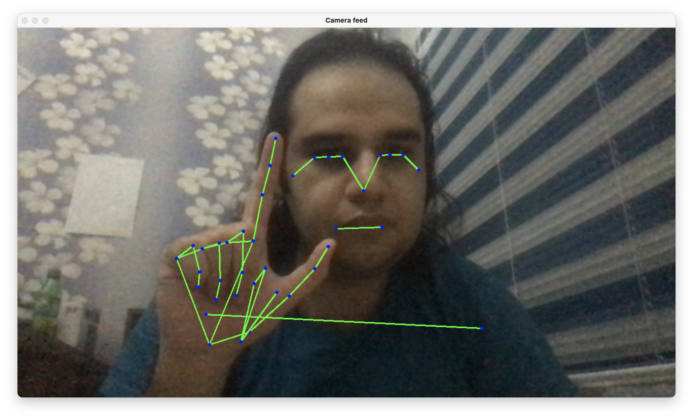

# Landmark detection using mediapipe 

[Media Pipe](https://google.github.io/mediapipe) is a really cool tool for machine learning and image detection/recognition projects. I always wanted to test it and find out how it works. Finally, I could find the free time to make a small project using this tool. 

## Sample 

